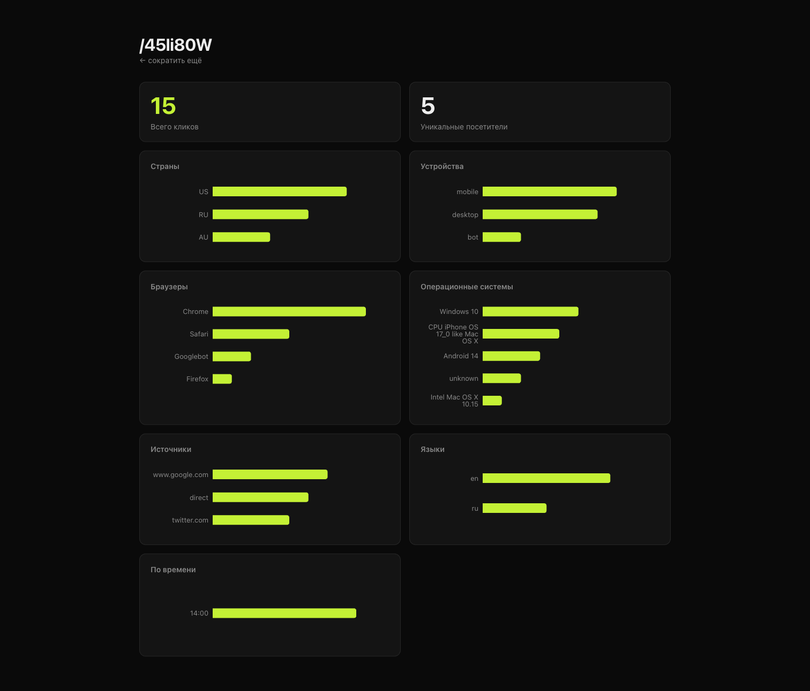
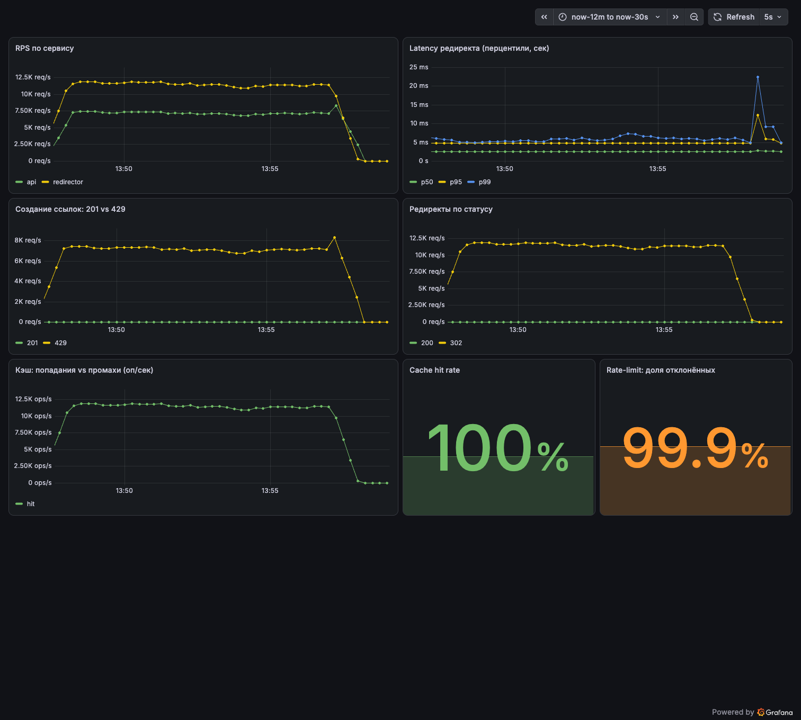

# urlshortener


Сокращатель ссылок, на котором я учу Go и практикую system design под нагрузку.
Простую предметную область выбрал намеренно - чтобы фокус был не на фичах, а на
том, как сервис держит нагрузку на чтение: read/write split на два отдельных
сервиса, дальше по плану кэш и очередь для аналитики.

## Как выглядит

Сокращатель и дашборд статистики (устройства, страны, браузеры, источники, уникальные посетители):




Grafana под нагрузкой k6 - RPS, latency, cache hit rate:



## Стек

Go 1.26 · chi · pgx + sqlc + goose · PostgreSQL · testcontainers · Docker Compose

## Архитектура

Read/write split: путь записи (создание ссылки) и путь чтения (редирект) - это
два отдельных сервиса поверх общей БД. Читателей на порядки больше, поэтому их
масштабируют независимо от писателей.

```
   POST /api/links                         GET /{code}
        │                                       │
        ▼                                       ▼
   ┌─────────┐                            ┌────────────┐
   │   api   │                            │ redirector │
   └────┬────┘                            └──────┬─────┘
        │             ┌──────────┐               │
        └────────────▶│ Postgres │◀──────────────┘
                      └──────────┘
```

Короткие коды генерируются случайно (base62) с проверкой уникальности через
UNIQUE-констрейнт и ретраем при коллизии. Рассматривал вариант с глобальным
счётчиком и кодированием его в base62 - он проще и без коллизий, - но отказался:
последовательные коды предсказуемы, перебором можно пройтись по чужим ссылкам.
Случайные коды это исключают, а вероятность коллизии на пространстве 62^7
(~3,5 триллиона комбинаций) невероятно мала.

## Запуск

**Весь стек в Docker одной командой** (инфра + сервисы + фронт):

```bash
make up      # собирает образы и поднимает всё; фронт на localhost:8082
make down    # остановить
```

Или локально для разработки (нужен Go 1.26):

```bash
make db-up            # инфра в Docker (Postgres, Redis, Kafka, Prometheus, Grafana)
make migrate-up       # накатить схему
make kafka-topic      # создать топик
make run-api          # сервис создания ссылок  → :8080
make run-redirector   # сервис редиректа        → :8081  (в отдельном терминале)
make run-analytics    # consumer аналитики       (в отдельном терминале)
```

## API

| Метод | Эндпоинт | Что делает |
|-------|----------|-----------|
| `POST` | `:8080/api/links` | создать ссылку; тело `{"url": "..."}` → `{"code", "short_url"}` |
| `GET`  | `:8081/{code}` | `302` на оригинальный URL, `404` если кода нет |

```bash
curl -X POST localhost:8080/api/links -d '{"url":"https://go.dev"}'
# {"code":"7vJ0BWW","short_url":"http://localhost:8081/7vJ0BWW"}

curl -I localhost:8081/7vJ0BWW
# HTTP/1.1 302 Found
# Location: https://go.dev
```

## Тесты

```bash
make test   # go test ./... - юнит + интеграционные
```

Интеграционные тесты поднимают настоящий Postgres в Docker через
`testcontainers`, поэтому для них тоже нужен запущенный Docker.

## Наблюдаемость и нагрузка

Каждый сервис отдаёт метрики Prometheus на `/metrics` (RPS, latency, cache hit rate).
`make db-up` поднимает Prometheus (`:9090`) и Grafana (`:3000`, дашборд `urlshortener`
провижится из коробки).

Нагрузочный тест горячего пути редиректа (k6, 50 VU, 30с):

```bash
k6 run loadtest/redirect.js
```

Результат на локальной машине (Apple Silicon): **~22 800 RPS**, latency p95 **3.5 мс**,
cache hit rate **100%**, ноль ошибок - редиректы отдаются из Redis-кэша, БД не тревожится.

Создание ссылок защищено **token-bucket rate limiter** - распределённым, на Redis
(общий лимит для всех инстансов api, атомарно через Lua): burst 20, 10 req/сек на IP.

Нагрузочный тест записи:

```bash
k6 run loadtest/create.js
```

Из ~380 тыс. попыток за 20с пропускает ~290, остальным отдаёт `429` - всплеск до БД не доходит.
